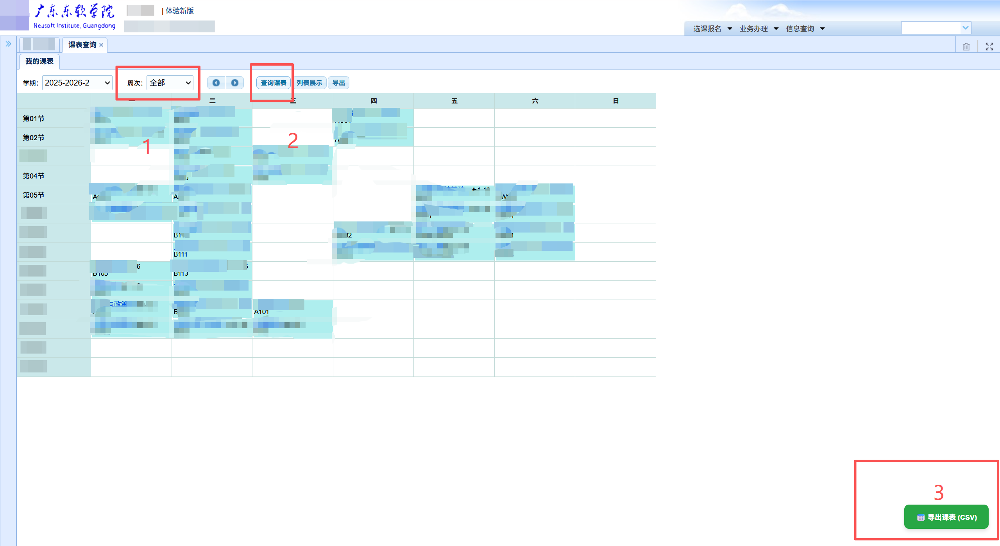

# 广东东软学院 (NUIT) 课表导出助手 📅

这是一个专为**广东东软学院 (NUIT)** 学生编写的油猴脚本 (Tampermonkey Script)。它可以拦截并提取教务系统（jww.nuit.edu.cn）中的个人课表数据，自动处理复杂的上课周次和节次，并一键导出为标准的 CSV 格式，方便无缝导入至 **WakeUp 课程表** 等第三方 App。

## ✨ 功能特点

* **一键导出**：在课表页面右下角生成直观的导出按钮。
* **智能解析**：自动将教务系统杂乱的周数（如 `16,1,2,3...`）整理为人类可读且软件兼容的格式（如 `1-16` 或 `1-5、7-11`）。
* **完美兼容**：导出的 CSV 文件自带 UTF-8 BOM，Excel 打开不乱码，且字段对齐 WakeUp 课程表的导入标准。

---

## 🚀 快速开始

### 1. 安装油猴脚本

1. 确保你的浏览器已安装 [Tampermonkey (油猴)](https://www.tampermonkey.net/) 扩展。
2. 点击浏览器右上角的油猴图标，选择 **添加新脚本 (Create a new script)**。
3. 将本项目中的 `main.js` 代码全部复制并粘贴到编辑器中，保存（快捷键 `Ctrl + S` 或 `Cmd + S`）。

### 2. 获取并导出课表

1. 登录广东东软学院教务系统，进入 **学生个人学期课表** 页面 (`/xsgrkbcx!xsAllKbList.action`)。
2. 页面加载完成后，点击右下角出现的 **“导出整理版课表 (CSV)”** 按钮。
3. 浏览器会自动下载一个名为 `课程表.csv` 的文件。

### 3. 导入 WakeUp 课程表

拿到 `课程表.csv` 文件后，你可以将其发送到手机上，然后使用 WakeUp 课程表的导入功能进行解析。

📖 **详细的导入教程请参考 WakeUp 官方文档：**
[从 CSV 文件导入教程](https://wakeup.fun/doc/import_from_csv.html)

---

## 📸 效果演示

---

*(上图为脚本运行及导入成功后的效果展示)*

---

## 📝 字段映射说明

导出的 CSV 包含以下字段，完全适配常见课程表的解析需求：
`课程名称` | `星期` | `开始节数` | `结束节数` | `老师` | `地点` | `周数`
